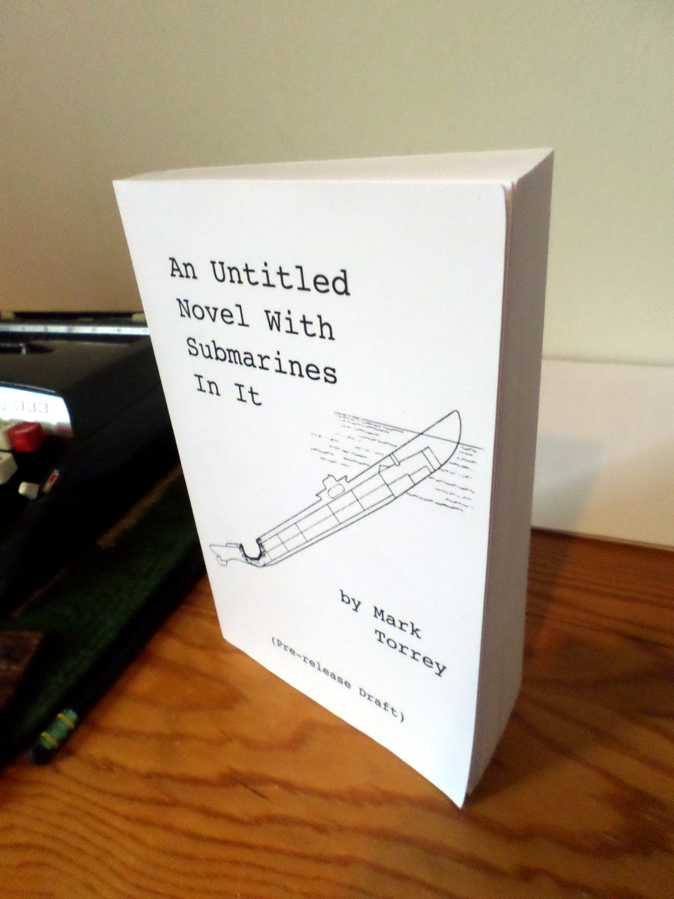

## Read it:
* The title of the book: _An Untitled Novel With Some Submarines In It (pre-release version)_
	* So actually the book is currently lacking a title. Suggestions welcome!
	* Note **pre-release version**: the downloadable files are the book version of beta software.
* Download a [pdf version](content/Subworldbook1+diagrams.pdf)
* Download an [epub version](content/Subworldbook1.epub)
	* (Should work with all e-readers and e-reader software) 
* Read it as [one really long unformatted webpage](content/Subworldbook1.html) 
* Reference diagrams of the protagonist submarines in the novel: [Submarine diagrams](content/standalone_sub-diagrams.pdf) 
	* Extremely helpful for orientation. Keep the diagrams handy!
* "Source code" for the novel (it's just markdown): [source code](http://github.com/grannycart/subworld-book1/)
	* Compile your own e-reader (epub) or pdf file to read!
	* Check out this github repo for licensing information and development details.
* Is there a paper version?
	* Yup. Contact me if you want an advance reader's copy.
 

## Some Information:
Above you can read a complete (120k+ words, 400+ pages) draft of a novel
for free. It's about submarines. Not nuclear submarines, or modern
submarines, or any kind of submarine that actually existed. It is about
_cargo_ submarines. In a mid-century Earth where, due to the economic
circumstances of the world having skewed off slightly from the path
followed in real life, submarines ended up being recruited to do the
trucking of cargo around the world. So: not exactly like other submarine
stories you may have encountered. (Also, far more women are involved
than the typical submarine story.)

What's it like? 

It's kind of a slurry of _Das Boot_, _Road Warrior_, _Deadliest Catch_, and
_Smokey and the Bandit_. Maybe with some _China Syndrome_ and _Jaws_
thrown in. (Though the latter's similarity is in theme only --- there's
no sharks in the book. Sorry.) It is undoubtedly speculative fiction,
though what more specific genre beyond that is maybe a little fuzzy. It
is also an action-packed page-turner! It should be entertaining to read.
If you find this isn't the case, you should probably let me know.

In its current state it is a complete novel, though a pre-release
draft. What does that mean? It is a whole story, and has been wholly
edited by the author (me) but not an editor. Take from that what you
will. There may be (almost certainly are) some spelling and grammar
errors that need fixing, some parts that are overwritten, some parts
that are underwritten, and maybe some parts that should be cut or
moved around. But there should be no part where you are wondering to
yourself "wait, what the fuck is going on here?" If you find yourself
asking that, you should probably let me know.

Since this is a pre-release, if you do read it, or even part
of it, I would appreciate your feedback. If you don't know how to
contact me through github, just email me: grannycart@protonmail.com.

More detailed FAQ on its way!

[//]: # (Eventually, when there is more than one story, this page should be re-oriented towards the series, rather than the one book. Each story should just be part of this page.)

