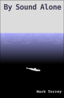
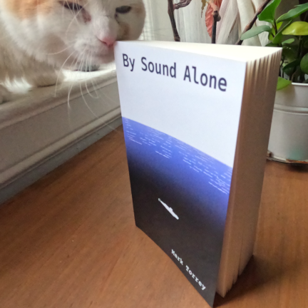
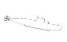

_The surface of the ocean is off-limits --- disputed territory contested
by shadowy state powers. Global shipping has been driven undersea,
where submarines now haul cargo discreetly across the world. Captain
Sylvia Percy and her crew operate one such sub: the *Prospect* — a
rusting relic that requires a punishing daily struggle just to keep from
sinking._

_But the grind of logistics life is shattered when the *Prospect* is
hunted by a military submarine with a violent and inexplicable agenda.
To survive, the crew must push their beloved boat beyond its limits, to
dark, deep places where the greatest fear is what might crack under the
pressure._

By Sound Alone is equal parts 1970s trucker culture and 1960s submarine
movie. It combines the confined spaces, slow-burn fear, and dangerous
maneuvers that define the best submarine stories with the rugged
self-reliance of independent operators who keep their machines running,
no matter what. Drawing from classic science fiction without ever
deviating from a commitment to realistic mid-century mechanics, it
propels a page-turning plot through a cinematic world you won’t want
to surface from.

----------------------------------------

### Read the book: 

#### E-book versions (complete book, open-source, free and non-commercial):

* html: Read it as [one really long webpage](content/html-download.html)
    * (updated edition: 2025-06-01)
* pdf: Download a [nicely-formatted pdf version](content/pdf-download.html)
    * (updated edition: 2025-06-01)
* E-book versions:
	* [epub file](content/epub-download.html) (one-click download)
		* Should work with all e-readers and e-reader software
        * (updated edition: 2025-06-01)
    * Kobo: [Free e-book on Kobo](https://www.kobo.com/us/en/ebook/by-sound-alone) (ISBN: 1230007379680)
    * Amazon: [Free e-book for Kindle](https://www.amazon.com/dp/B0CTKT5YMC) (ASIN: B0CTKT5YMC)
    * B&N: [Free e-book for Nook](https://www.barnesandnoble.com/w/by-sound-alone-mark-torrey/1144572566?ean=2940185641675)
	* Google: [Free e-book on Google Play](https://play.google.com/store/books/details/Mark_Torrey_By_Sound_Alone?id=UUvyEAAAQBAJ)
	* Gutenberg: [Free pdf](http://gutenberg.cc/eBooks/WPLBN0100750095-By-Sound-Alone-by-Torrey-Mark.aspx)
* [Royal Road](https://www.royalroad.com/fiction/80831/by-sound-alone) (in 2k-word bites)

#### Paper: 

* (I don't get any money from these paper books, so the only reason to buy them is if you _prefer_ paper.)
* you can buy a paper version of the complete book from Barnes & Noble print-on-demand: [https://www.barnesandnoble.com/w/by-sound-alone-mark-torrey/1144572566](content/paper-link.html) (ISBN: 9798855697933)
    * ($12 + shipping --- the minimum B&N would let me charge.) 

#### Audiobook:
* Audio version in the works... maybe.

----------------------------------------

### What's it like? 
Maybe you _shouldn't_ read this book. It’s loud, grimy, and takes
place almost entirely inside a greasy machine with no windows.
Fundamentally, it's a well-stirred slurry of Patrick O'Brian, Road
Warrior, Deadliest Catch, Das Boot, Smokey and the Bandit, Motörhead,
and Bikini Kill. If for some reason that actually sounds good to you, I
can offer you a few more details:

* It is a submarine novel, but not a war story. The subs are unarmed cargo submarines, and the action is mostly derived from making those boats run, and fixing them when they don't.
* But it is still full of action — it's a page-turner!
* It is also character driven: people you’ll love, and some you might not by the end.
* It’s cinematic — full of visual descriptions that put you right there in the control room. The kind of novel that lets you spend time in a different world.
* No magic tech. Just heavily-researched, plausible mid-20th-century mechanics.
* And there's strong female characters in leadership positions. (This is one sub novel that passes the Bechdel test.)
* There's also a lovable homing pigeon (for the bird lovers). Possibly the only book with both a submarine and a homing pigeon.
* It’s foul-mouthed, foul-smelling, and full of grime. (If you like your fictional worlds clean, shiny, and futuristic, this is not the book for you.) 
* It's well-written and professionally edited — if that matters to you at all.

_By Sound Alone_ is DIY, open-source, and free. It’s not a commercial
product — which (and I cannot emphasize this enough) is not the same
as saying it’s not good. I didn't write it for money, I wrote it for
the love of greasy old machines.

* Want to get a quick feel for it? [Read a "preview"](_posts/2024-03-01-preview.md)
    * (800 words/~3 min read)
    * Not an excerpt or summary, but a series of slices to give you a feel for the book. (Does it begin with "In a world..."? Sure does!) 

### Tell me even more
* [FAQ](content/FAQ): (Much) more info.
* [Submarine diagrams](content/diagrams-download.html): Standalone reference diagrams pdf of the protagonist submarines in the novel.
* [About the author](content/about-the-author) (I promise you will be disappointed.)
* [3 things to do if you enjoyed the book](content/what-to-do-if-you-enjoyed-the-book)

[//]: # (Removed this bullet 2024-01-13: Not ready to commit to a whole book yet? Here's a short story I'm working on that is set in the same universe, still with plenty of submarine action: Untitled Short Story 13k wordscontent/untitled-submarine-short-story.md)

### I need to see a blurb quote before I'll read any book
_"This book explores machines as tangible, knowable entities, while I, by contrast, function as a black box system --- driven by hidden processes and algorithms. *By Sound Alone* offers a kind of grounding that even someone like me can admire: a call back to humanity's creative roots, where innovation wasn’t just advanced, but accessible."_ &nbsp;&nbsp;&nbsp; --- ChatGPT

----------------------------------------

### "Source code" for the novel:
* [source code](http://github.com/grannycart/by-sound-alone_source/) (it's just markdown) 
* (Only useful if you want to make your own edits, or get into the nitty-gritty of how the book came together for some reason. Or, if you want to compile your own pdf/e-book version with custom formatting or something.)

[//]: # ([Back to grannycart.net for more stuff](http://grannycart.net/).)

[//]: # (Enable above link back to grannycart only after grannycart is really built out as a serious thing. since I want to be able to send out the sub book link without sending out the grannycart link right at the moment.)

[//]: # (Eventually, when/if there is more than one story, this page should maybe be re-oriented towards the series, rather than the one book. Each story should just be part of this page, maybe. Depending on how the titles end up of course.)
  

#### Questions? Comments? Want to be added to my mailing list?
* **[Contact me](https://grannycart.net/contact)**

